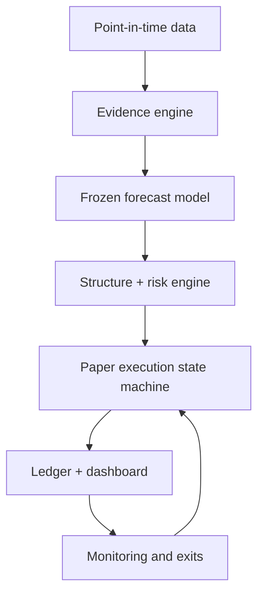
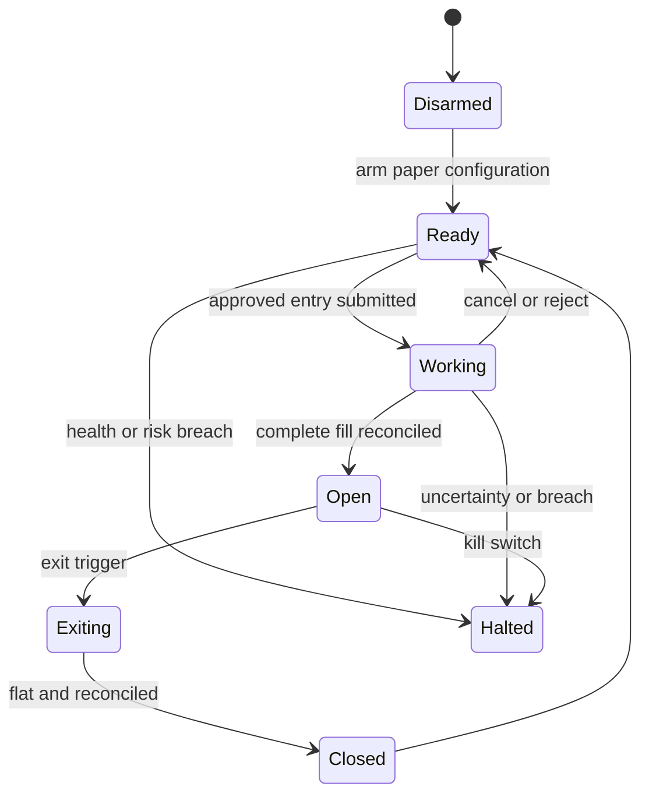

# AlphaLedger: options alpha agent design specification

Version: replanned baseline, 27 Aug 2026  
Mode: Alpaca competition paper account only  
Competition window: 28 Aug 2026 15:00 UTC to 4 Sep 2026 15:00 UTC

## 0. Decision summary

Build a cross-sectional scanner, not a single-ticker chat flow. The agent
searches a frozen universe of liquid optionable underlyings, predicts forward
market/sector-neutral returns from price-volume and point-in-time news
features, and uses defined-risk options to express only signals that survived
chronological validation and current risk/liquidity gates.

The differentiator is an **evidence ledger**. Every scan produces a
machine-readable card showing:

- what the agent knew at that timestamp;
- how each independent signal family contributed;
- the calibrated forecast and its uncertainty;
- the chosen options structure and exact payoff bounds;
- every risk and data-quality gate;
- the actual order/fill lifecycle; and
- counterfactual price-only, news-only, and no-trade shadow outcomes.

This is autonomous after one explicit paper-only arm action. The LLM may label
news and explain already-computed results. It may not calculate returns,
choose arbitrary structures, change the model, size positions, or improvise
orders.

## 1. Objective, scope, and non-goals

### Objective

Generate competition paper P&L with a clear, testable, reproducible options
strategy while making the agent's decisions legible enough for judges to
audit in minutes.

### MVP scope

- 20 to 30 highly liquid, US-listed, optionable stocks and broad ETFs.
- Three scheduled scans per session plus event-triggered rescans on new news.
- Two alpha families: residual price/volume and structured news.
- One live strategy family: bullish or bearish debit verticals.
- One to four concurrent positions, all defined-risk.
- Automated entry, reconciliation, monitoring, exit, and kill switch.
- A compact dashboard and append-only evidence/trade ledger.

### Conditional extensions

- Options-surface/flow features only if OPRA-quality data is available and a
  separate walk-forward test passes.
- Defined-risk credit verticals only if a volatility-rich signal is validated.
- Iron condors and long straddles/strangles only after a directional-versus-
  volatility forecast is independently calibrated. They are not MVP.

### Non-goals

- No live-money endpoint or credential path.
- No 0DTE, naked options, discretionary ticker requests, high-frequency
  trading, earnings gambling, or unbounded strategy generation.
- No claim that an abnormal contemporaneous reaction is itself a forecast.
- No threshold tuning on competition P&L and no “demo ticker hunting.”
- No fabricated POP, EV, strike, quote, Greek, or fill.

## 2. Alpha thesis

An alpha is a forecast of a *future* return, not a description of what already
happened. AlphaLedger therefore predicts a forward residual return:

\[
y_{i,t,h}=r_{i,t\rightarrow t+h}
-\hat\beta_{m,i,t}r_{m,t\rightarrow t+h}
-\hat\beta_{s,i,t}r_{s,t\rightarrow t+h},
\]

where the betas use only information available before time \(t\), the market
proxy is SPY, the sector proxy is declared in a static mapping, and the MVP
horizons are one and three trading sessions.

The hypothesis is deliberately modest:

1. A residual price move, abnormal volume, and news do not contain the same
   information.
2. News impact depends on direction, novelty, relevance, category, surprise,
   and the initial price/volume reaction.
3. Several weak features may be useful together even when none is reliable
   enough alone.
4. A signal is tradable only when its expected move remains meaningful after
   conservative option execution costs and portfolio constraints.

The original event study survives as one input. `CAR`, its standardized
reaction, and abnormal volume describe the market's initial response. They do
not answer whether the next return will continue, reverse, or be noise; the
historical, out-of-sample relationship to \(y_{i,t,h}\) must answer that.

## 3. System architecture



| Component | Owns | Must not own |
|---|---|---|
| Data recorder | timestamps, raw responses, feed identity, cache | interpretation |
| LLM news labeler | fixed-schema language labels and short evidence spans | returns, forecasts, sizing, orders |
| Evidence engine | dedupe, residuals, volume features, option features, quality flags | prose judgment |
| Forecast service | frozen coefficients, calibration, uncertainty, shadow forecasts | chain selection or execution |
| Structure engine | real-chain enumeration, payoff algebra, stress marks | alpha creation |
| Risk engine | portfolio limits, data/liquidity gates, immutable approval token | explanations or parameter changes |
| Orchestrator | sequence, tool use, retries, reconciliation, evidence summaries | math, model edits, manual overrides |
| Order adapter | Alpaca schema mapping and idempotent order lifecycle | trade thesis |

One orchestrator is enough. A second “critic agent” adds latency and failure
surface without creating independent evidence; it is a stretch feature, not a
foundation.

The specialists under `.claude/agents/` and `.codex/agents/` are equivalent
development-time, read-only research and code-review roles. They never
participate in the trading decision loop, hold broker authority, or change
this one-orchestrator runtime design.

## 4. Universe, cadence, and point-in-time discipline

### Frozen universe rule

At each prior close, form the next session's universe from symbols that are:

1. active, tradable, and `options_enabled`;
2. at least $10 at the prior close;
3. ranked in the top cohort by trailing 20-session median dollar volume;
4. supported by at least one 7 to 21 DTE expiration with non-zero two-sided
   quotes near the money; and
5. free of unresolved symbol changes or corporate actions.

Cap the MVP at 30 names. The exact size and liquidity floors are selected on
development/calibration data, recorded in the trial registry, then frozen
before the first autonomous session. A static checked-in fallback list is
allowed if reliable point-in-time optionability history cannot be assembled;
the limitation must be disclosed.

The user cannot inject a symbol into the live candidate set. A read-only demo
lookup is allowed but never routes to execution.

### Cadence

- Reconcile account, orders, positions, and health before every session.
- Build the universe from lagged data; never use same-session winners to
  decide what “was in” the universe.
- Scheduled scans: approximately 10:00, 12:30, and 15:00 ET.
- Event rescan: only on a newly observed, eligible Alpaca news item.
- Do not open a new position during the first 10 minutes, final 45 minutes,
  a configured data incident, or the submission-day wind-down.

### Timestamp contract

Every observation stores `event_time`, `first_seen_time`, `source_time`,
`received_time`, `feed`, and `as_of`. Historical features are reconstructed as
of `first_seen_time`; revisions published later are different observations.
No labeler receives forward prices, future headlines, or a future-derived
category.

Use the same equity feed definition in research and live runs; do not train on
consolidated SIP bars and operate on IEX-only observations without a declared
compatibility test. Store the feed on every record and halt or switch to an
explicitly validated degraded model if it changes.

Historical news APIs may not prove the exact delivery time or preserve the
first version of mutable article text. When that happens, treat the published
timestamp as a lower-bound availability proxy, add a fixed conservative
latency buffer, prefer immutable headline/summary fields, and disclose the
limitation. If a point-in-time version cannot be reconstructed without a
plausible look-ahead path, exclude that field or article from model fitting.

## 5. Evidence families

### 5.1 Residual price and volume

Use a rolling, robust market/sector model over a fixed lookback selected
before the live run. Candidate features include:

- one-session and five-session residual return;
- opening gap residual;
- cumulative abnormal return from an event timestamp;
- residual-return z-score using trailing residual volatility;
- abnormal volume versus the same time-of-day baseline where intraday data
  exists, otherwise versus trailing daily volume;
- range divided by ATR; and
- proximity to a recent price extreme.

Winsorization, missing-value behavior, sector mapping, and lookback lengths
are configuration, not LLM judgment. They are versioned and frozen.

### 5.2 Point-in-time news

Use Alpaca's historical/real-time news feed as the MVP source. External web
search is not required for the trading path; it adds timestamp and licensing
complexity and is the first integration to cut.

The LLM receives the article plus a deterministic, point-in-time list of
earlier related headlines when available, and returns only a fixed schema:

- `direction`: positive, negative, mixed, or neutral;
- `category`: earnings, guidance, analyst, regulatory/legal, product,
  financing/M&A, management, macro/industry, or other;
- `novelty`: new, follow-up, or duplicate;
- `relevance`: direct, industry-linked, or incidental;
- `surprise`: unexpected, partly expected, routine/expected, or unknown;
- `ambiguity`: low, medium, or high;
- entity/ticker match; and
- short evidence spans copied from the input.

Deterministic code performs timestamp validation, duplicate clustering,
source counting, ticker mapping, and label-to-feature encoding. A headline is
never “corroborated” merely because several outlets syndicated the same wire
story.

### 5.3 Options surface and activity: capability-gated

Potential features, motivated by the attached book's options-market chapter,
are:

- 25-delta put-versus-call skew or risk reversal;
- ATM term-structure slope;
- implied versus realized volatility;
- option-to-stock volume;
- call/put volume imbalance; and
- changes in call/put open interest.

Open-interest features use Alpaca's reported `open_interest_date`; they are
lagged end-of-day evidence, never described as live flow.

They are disabled by default. Alpaca's Basic plan supplies an indicative
options feed whose quotes are modified and whose trades are delayed; that is
not a defensible foundation for microstructure alpha. Enable this family only
when all of the following are true:

1. the competition account has OPRA access;
2. the stored feed identifier proves OPRA was used;
3. missing Greeks/IV and stale-chain rates pass declared quality limits;
4. the feature is reconstructible point-in-time from Alpaca history, which
   begins only in February 2024; and
5. a separate chronological test beats the baseline after costs.

If these conditions fail, options remain the *instrument* used to express the
stock/news forecast, not evidence used to create it.

## 6. Forecast model and decision gate

### Model

Keep one deliberately simple pooled model across the universe:

- ridge/logistic model for the probability that the forward residual is
  positive;
- ridge/Huber model for forward residual magnitude; and
- calibration on a later chronological slice, never on the final test slice.

Do not include symbol identity as a free memorization feature. Sector and
volatility regime may be coarse controls. Purge at least the forecast horizon
between chronological folds to prevent overlapping-label leakage.

For each horizon, output:

```text
p_up, expected_residual_return, q10, q50, q90,
calibration_error, effective_sample_size, feature_contributions,
data_quality, model_version, as_of
```

The historical-analog view remains visible: show the closest past events and
their subsequent residual returns. It is an explanation and sanity check,
not a license to cherry-pick neighbors.

### Trade eligibility

A candidate reaches structure construction only when:

1. at least two enabled evidence families agree on direction; in MVP this
   means the price/volume and news families both contribute with the same
   sign;
2. the model clears a probability threshold chosen on the calibration set to
   target precision, subject to a non-negotiable floor set before arm time;
3. expected move exceeds a conservative round-trip cost hurdle;
4. uncertainty, effective sample size, and calibration are within their
   frozen limits;
5. the signal is not concentrated in one symbol, one week, or one sector in
   the held-out evaluation; and
6. current data, chain, account, and portfolio checks pass.

If the news family is unavailable, the MVP does not silently downgrade to a
price-only live trade. The price-only output continues in a shadow book until
a separately predeclared fallback model is validated.

### Ranking

Rank eligible candidates by conservative forecast edge after estimated cost,
then diversify by underlying and sector. Take at most the top one or two per
scan and enforce a one-position-per-underlying rule. Do not transform a weak
forecast into a trade merely because the portfolio is empty.

## 7. Validation protocol

### Dataset split

Use an expanding, chronological walk-forward:

1. **Training:** fit coefficients and transformations.
2. **Calibration:** choose one decision threshold and calibrate probabilities.
3. **Locked test:** one final untouched period for the go/no-go result.
4. **Competition:** prospective observation only; no retuning.

All feature trials, lookbacks, thresholds, universes, and discarded variants
go into a trial registry. More than one tested variant triggers an explicit
multiple-testing warning; report probability of backtest overfitting or a
deflated performance statistic if the sample supports it.

### Required baselines and ablations

| Book | Question |
|---|---|
| Market/sector-neutral random ranking | Does the pipeline beat chance? |
| Price-volume only | Does language data add anything? |
| News only | Does market confirmation add anything? |
| Combined frozen model | Does combining weak evidence improve calibration/P&L? |
| Combined model minus each feature group | Is one group decorative or harmful? |

### Metrics

- Forecast: Brier score, calibration curve, rank IC, sign precision/recall,
  mean residual by score decile.
- Trading: cost-adjusted P&L, profit divided by capital at risk, max drawdown,
  hit rate, turnover, time in market, and exposure by sector/direction.
- Robustness: performance by time slice, sector, volatility regime, and symbol;
  parameter sensitivity; shuffled-label negative control.
- Operations: data freshness, scan latency, order acceptance/fill/cancel rate,
  reconciliation errors, and time in degraded state.

Backtests use only contemporaneously available data and conservative executable
prices. Midpoint fills are a diagnostic, never the headline result.

## 8. Options expression layer

### MVP strategy

Only directional debit verticals go live initially:

| Forecast | Structure | Construction |
|---|---|---|
| Positive residual | Call debit spread | Buy near-ATM call; sell higher-strike call; same expiry |
| Negative residual | Put debit spread | Buy near-ATM put; sell lower-strike put; same expiry |
| Weak, mixed, or poor quality | `no_trade` | No legs |

Use 7 to 21 DTE, no same-day expiration, and close before expiry. Enumerate real
chains rather than asking the LLM for strikes. Initial target bands are roughly
0.45 to 0.60 absolute delta for the long leg and 0.20 to 0.35 for the short leg,
subject to current quote quality. The engine selects among candidates using
liquidity, cost drag, forecast alignment, and exact risk, not the nearest delta
alone.

### Extensions after validation

| Direction forecast | Volatility state | Defined-risk extension |
|---|---|---|
| Bullish | IV demonstrably rich | Bull put credit spread |
| Bearish | IV demonstrably rich | Bear call credit spread |
| Neutral | Rich IV + calibrated range forecast | Iron condor |
| Direction uncertain | Implied move below calibrated realized-move forecast | Long straddle/strangle |

These are disabled if there is no independently validated volatility forecast.
The original four-strategy playbook is a useful bounded menu, but “available”
must not be confused with “validated.”

### Exact payoff algebra

For a debit vertical with width \(W\) and net debit \(D\), per contract:

- maximum loss = \(100D\);
- maximum profit = \(100(W-D)\);
- call-spread expiry breakeven = long-call strike + \(D\);
- put-spread expiry breakeven = long-put strike − \(D\).

Compute from signed leg prices and verify invariants in unit tests. A spread
with \(D\le0\), \(D\ge W\), inconsistent expiration/underlying, or a naked
short leg is invalid.

### Pricing and scoring

Record four prices for every candidate: bid, ask, midpoint, and conservative
natural price. Rank on a conservative entry/exit assumption and show the
midpoint result only as sensitivity.

For a debit entry, natural debit is the long-leg ask minus the short-leg bid;
midpoint debit uses both leg midpoints. For a close, natural credit is the
long-leg bid minus the short-leg ask. Round-trip cost assumptions include both
sides and are stored with quote timestamps.

Do not manufacture POP or EV from a zero-drift GBM. The directional forecast
comes from the empirical model. The structure report contains:

- exact max loss/profit and expiry breakeven;
- net delta/gamma/theta/vega when Alpaca provides valid Greeks;
- P&L across the model's empirical underlying-return quantiles;
- constant-IV and adverse-IV stress marks if a repricer is validated;
- quote-age and spread-cost sensitivity; and
- a clear label separating empirical forecast quantities from modeled option
  marks.

If no validated pre-expiry repricer exists, do not call scenario averages
“expected value” or scenario hit rates “probability of profit.” Use the fixed
structure rule, exact payoff bounds, and conservative stress table instead.

## 9. Liquidity and data-quality gates

A candidate is blocked if any required leg has:

- zero or crossed bid/ask;
- a quote older than the configured freshness limit;
- missing contract metadata or inconsistent multiplier;
- missing Greeks when the intended rule depends on Greeks;
- bid/ask width beyond the frozen relative and absolute thresholds;
- insufficient displayed size for the proposed quantity; or
- a feed identity inconsistent with the configured capability mode.

Paper fills are not evidence of live liquidity. Alpaca documents that paper
orders are simulated at current best prices, ignore market impact and queue
position, and do not cap quantity by displayed NBBO size. AlphaLedger therefore
caps its own quantity, records displayed size, and maintains both:

- broker-reported competition P&L; and
- conservative mark/fill-adjusted P&L for credibility.

In indicative-feed mode, options may be used for contract selection only after
the Day-1 integration test shows that bounded limit orders behave coherently
with the paper simulator. Costs and quote quality remain labeled indicative;
the mode never enables options-surface alpha. If an indicative plan cannot be
priced within its risk bound against paper NBBO, let it expire unfilled rather
than chase an unseen market.

## 10. Risk policy

The following are initial engineering defaults for a $100,000 competition
paper account, not statistically optimized constants. Confirm contest rules
and freeze the actual values before arming.

| Limit | Initial default |
|---|---:|
| Maximum loss per new trade | 0.75% of current equity |
| Total open defined risk | 3.0% of current equity |
| Sector open risk | 1.5% of current equity |
| Concurrent positions | 4 |
| Positions per underlying | 1 |
| Contracts per structure | min(risk-sized quantity, 3, displayed-size cap) |
| Daily realized + unrealized loss stop | 1.5% of session-start equity |
| Peak-to-valley equity kill switch | 3.0% |

Additional hard rules:

- no naked or partially covered short legs;
- no intentional exercise or assignment exposure;
- no averaging down, doubling, martingale sizing, or re-entry after a stop on
  the same underlying that session;
- no new position if portfolio Greeks are missing when required or exceed
  frozen delta/vega/gamma caps;
- no trade during a stale-data, clock, account, or reconciliation incident;
- cancel all working entries when the system halts; and
- flatten before the internal competition cutoff and before expiry.

Risk approval returns an immutable approval ID bound to the candidate,
account snapshot, payload hash, quantity, price ceiling/floor, and expiry time.
Any mutation invalidates approval and requires a new deterministic check.

## 11. Autonomous order lifecycle

One explicit arm action enables a frozen configuration on the competition
paper account. There is no per-trade confirmation; that would make the system
a recommender rather than an autonomous agent. Disarm, emergency halt, and
manual flatten remain available.



### Entry

1. Verify paper endpoint/account, market clock, configuration hash, data health,
   and reconciled state.
2. Obtain a deterministic risk approval.
3. Submit a same-expiry Alpaca `mleg` DAY limit order with an idempotent
   `client_order_id`.
4. Start near the executable midpoint, move toward the conservative natural
   price in a small bounded ladder, and cancel after the final limit or time
   budget. Never silently cross the risk engine's price bound.
5. Confirm the order through order status and account activity/positions. An
   unknown result is not a failure that may be blindly retried.

### Exit

Create the opposing multi-leg limit order, cancel any conflicting working
order, and reconcile until flat. Multi-leg stop orders are not assumed; the
agent itself monitors exit conditions. If the normal ladder cannot flatten,
escalate to the emergency policy already authorized in the frozen risk config.

### Integration caveat

Alpaca MCP V2 changed tool names and parameters relative to V1. Pin the tested
version and perform a Day-0/Day-1 schema smoke test. The MCP project has also
had a [reported multi-leg `legs` serialization
issue](https://github.com/alpacahq/alpaca-mcp-server/issues/97); keep a thin
direct Trading API adapter as the tested fallback. Never discover this during
the final session.

## 12. Position management and exits

Each position has a machine-generated plan at entry:

- thesis horizon and last valid timestamp;
- profit-taking, loss-budget, and signal-invalidation conditions selected
  from the locked validation, not improvised live;
- maximum holding period;
- news/data conditions that force review or exit;
- expiry cutoff; and
- competition wind-down cutoff.

Monitor underlying data, option quotes, model forecast, account equity, order
state, and risk at a fixed cadence. An exit occurs when the forecast loses its
eligibility, the loss budget is breached, the horizon expires, the portfolio
kill switch fires, data becomes irrecoverably stale, or the hard time cutoff
arrives. No trade may remain open merely because an option mark is missing.

## 13. Evidence ledger and dashboard

### Append-only records

For every candidate, including `no_trade`, store:

- raw-data hashes and timestamps;
- feed and capability mode;
- news labels plus input evidence spans;
- feature values and model contribution by family;
- forecast distribution, calibration metadata, analog count, and versions;
- candidate structures and rejection reasons;
- risk approval or exact failed gates;
- order requests, responses, replacements, fills, and reconciliations;
- exits, realized P&L, conservative adjusted P&L; and
- shadow-book outcomes.

Secrets, full credentials, and sensitive headers never enter the ledger.

### Dashboard hierarchy

1. Broker P&L, conservative P&L, open max loss, daily loss budget, arm/halt
   state, and data health.
2. Open positions with forecast, option structure, exit timer, and risk.
3. Latest trade and `no_trade` evidence cards.
4. Live versus price-only, news-only, and random/shuffled shadow curves.
5. Model/config/prompt hashes and last successful reconciliation.

The public story is not “an AI found a magic trade.” It is “an autonomous
agent shows exactly when evidence was strong enough to act, when it abstained,
and what would have happened under simpler alternatives.”

## 14. Core data contracts

```python
@dataclass(frozen=True)
class NewsLabel:
    article_id: str
    source_time: datetime
    first_seen_time: datetime
    direction: Literal["positive", "negative", "mixed", "neutral"]
    category: str
    novelty: Literal["new", "follow_up", "duplicate"]
    relevance: Literal["direct", "industry_linked", "incidental"]
    surprise: Literal["unexpected", "partly_expected", "expected", "unknown"]
    ambiguity: Literal["low", "medium", "high"]
    evidence_spans: tuple[str, ...]
    labeler_version: str

@dataclass(frozen=True)
class EvidenceCard:
    candidate_id: str
    symbol: str
    as_of: datetime
    data_mode: Literal["opra", "indicative_no_option_alpha"]
    price_volume_features: dict[str, float]
    news_features: dict[str, float]
    options_features: dict[str, float] | None
    quality_flags: tuple[str, ...]
    raw_data_hashes: tuple[str, ...]

@dataclass(frozen=True)
class Forecast:
    candidate_id: str
    horizon_sessions: int
    p_up: float
    expected_residual_return: float
    quantiles: dict[str, float]
    contribution_by_family: dict[str, float]
    calibration_error: float
    effective_sample_size: float
    eligible: bool
    rejection_reasons: tuple[str, ...]
    model_version: str

@dataclass(frozen=True)
class StructurePlan:
    plan_id: str
    candidate_id: str
    legs: tuple[dict, ...]
    quantity: int
    entry_limit_bound: float
    exact_max_loss: float
    exact_max_profit: float
    expiry_breakeven: float
    quote_times: tuple[datetime, ...]
    stress_pnl: dict[str, float]

@dataclass(frozen=True)
class RiskApproval:
    approval_id: str
    plan_id: str
    account_snapshot_hash: str
    order_payload_hash: str
    expires_at: datetime
    approved: bool
    failed_gates: tuple[str, ...]
```

## 15. Failure policy

| Failure | Response |
|---|---|
| Live or ambiguous endpoint | Halt before any order |
| Data feed or timestamp unknown | Disable affected family; halt if required by live model |
| Stale/missing chain or Greeks | Reject candidate |
| News label invalid JSON or low-confidence entity match | Exclude article; log reason |
| Unknown order submission result | Query by client ID; do not resubmit blindly |
| Partial/working order beyond budget | Cancel and reconcile; no unapproved legging |
| Position exists without ledger state | Halt new entries, reconstruct state, then decide exit |
| Risk/data/config hash changes after arm | Disarm and require explicit re-arm |
| Daily/drawdown limit breached | Cancel entries, execute authorized flatten policy, halt |
| Forecast service unavailable | Manage existing risk only; no new entries |

## 16. What was retained, corrected, and cut

### Retained from the Sonnet draft

- deterministic statistics, structure construction, sizing, and execution;
- LLM use for language classification and explanation;
- defined-risk strategies only;
- explicit `no_trade` behavior;
- quote freshness, liquidity, and data-quality gates;
- abnormal return/volume as useful evidence;
- exact payoff cross-checks and no invented numbers; and
- paper-only safety.

### Corrected

- Reaction measurement is now a feature; forward residual return is the
  target.
- Breadth replaces user-selected single-ticker bias.
- Chronological validation, baselines, costs, trial tracking, and robustness
  are mandatory.
- Options are both an expression layer and, only when data permits, a separate
  information source.
- The simulation no longer produces false POP/EV precision from zero-drift
  GBM.
- Risk includes sizing, aggregate exposure, monitoring, exits, and drawdown.
- Autonomy uses one frozen global arm instead of per-order confirmation.
- Execution moves from “most cuttable” to the first non-cuttable slice.

### Cut from MVP

- Tavily dependency;
- arbitrary single-ticker chat input;
- four live strategy families;
- multi-agent theater;
- live threshold tuning;
- option-flow alpha on indicative data; and
- a polished frontend before the full lifecycle works.

## 17. Source and assumption notes

The design uses the attached *Finding Alphas* (Igor Tulchinsky, ed., 2015) as
a source of research principles, especially its chapters on backtest
overfitting, data, robustness, news, and information in options markets. The
book motivates hypotheses; its historical examples and effect sizes are not
treated as current evidence.

Primary implementation and competition references:

- [Hackathon page](https://lablab.ai/ai-hackathons/alpaca-ai-trading-agents-hackathon)
- [Alpaca competition announcement](https://www.linkedin.com/posts/alpacamarkets_the-global-online-alpaca-ai-trading-agents-activity-7498016423563157504-dvZf)
- [Alpaca MCP Server documentation](https://docs.alpaca.markets/us/docs/alpaca-mcp-server)
- [Alpaca MCP Server repository](https://github.com/alpacahq/alpaca-mcp-server)
- [Options Level 3 / multi-leg orders](https://docs.alpaca.markets/us/docs/options-level-3-trading)
- [Paper-trading rules and assumptions](https://docs.alpaca.markets/us/docs/paper-trading)
- [Historical options data and feed definitions](https://docs.alpaca.markets/us/docs/historical-option-data)
- [Market-data plans](https://docs.alpaca.markets/us/docs/about-market-data-api)
- [Market-data FAQ for missing IV/Greeks](https://docs.alpaca.markets/us/docs/market-data-faq)
- [Historical news data](https://docs.alpaca.markets/us/docs/historical-news-data)

Research priors to test rather than assume:

- [Chan, “Stock Price Reaction to News and No-News”](https://papers.ssrn.com/sol3/papers.cfm?abstract_id=262452)
- [Xing, Zhang, and Zhao, “What Does Individual Option Volatility Smirk Tell Us About Future Equity Returns?”](https://papers.ssrn.com/sol3/papers.cfm?abstract_id=1107464)
- [Johnson and So, “The Option to Stock Volume Ratio and Future Returns”](https://papers.ssrn.com/sol3/papers.cfm?abstract_id=1624062)
- [Bailey et al., “The Probability of Backtest Overfitting”](https://papers.ssrn.com/sol3/papers.cfm?abstract_id=2326253)

Re-verify event rules, judging weights, account provisioning, data entitlement,
submission requirements, and the tested MCP/API schemas at kickoff. If a
rule conflicts with this document, the rule wins and the configuration must be
updated before arming, not silently during a live session.
